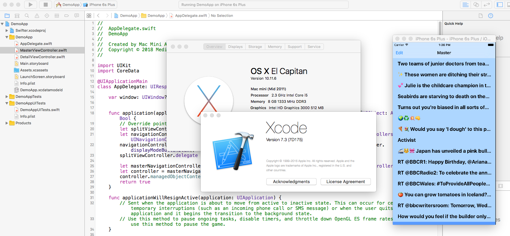

# MasterDetailTwiterDemoApp

This is a Master Detail Twitter Demo App for iOS written in Swift

This Demo App was built using Xcode 7.3 running OSX 10.11.6 

See screen shot below:

=======================

Hi I'm an experienced iOS developer with multiple apps in the app store and over 25 years of writing code for a living.

My applications development skill set includes hands-on experience with Java, Objective-C, PHP, JavaScript, Python, Perl and VB.net. The majority of my development time is focused on building cloud based mobile applications built using Android, iOS, Linux, and AWS.

However, I was asked to write a iOS "Demo App"" in Swift to demonstrate my ability to code. (BTW, This happens to be my first time using Swift all my iOS projects have been in Objective-C to date).

This was the note I received from the folks who requested I write this demo: 

> "Just remember - this is a not a test for competence, its a test for excellence." "Make sure you really show off what you’re capable of and the quality of what you can create. Everything should be documented and covered with a unit test and think about edge cases like no network, etc."

Their requirments were as follows: 

> Using any publicly available API of your choosing (examples include Yelp, Flickr, New York Times, etc.) build a simple, native iOS app with at least two screens. 
> One screen should show a list of items from that API while the second screen should show a detail view for those items. Use this as an opportunity to be creative and demonstrate your familiarity with the iOS platform.
> Tests are required. They may take any form deemed appropriate for the app but should demonstrate a basic understanding of testing an iOS app.
> Use of 3rd party libraries for common tasks (networking, image loading, etc.) is acceptable.
> The app must be placed in a public repo on a site like Github or Bitbucket.
> The app must be able to be pulled down from this repo and built without any additional configuration. For example, we should not be responsible for getting its own API keys or access.
> We're a senior group of folks who see software as a craft. We'll be looking for well-structured code that follows best practices, is tested, doesn't have errors, is commented appropriately (e.g. comment your header files), considers edge cases, and demonstrates your creativity and love of software.

The only issue:  I'm being asked to invest my time implementing all of the above without being offered any compensation for my time.  I have already invested a day learning Swift's syntax and building a demo that works well enough to prove I can build an iOS App in a whole new language.  If you want unit test coverage, handle edge cases, and an excellent looking UI you need to make a contractual commitment at some point.

Follow up:  After investing the time to create this project on spec the guys who asked me to do it flaked out on me.  After this no more free projects to prove I can write code.  I just built a demo in a language I have never used before in just over one day.  That should be enough proof I can code.

=======================

FYI: I'm not sure if this project will build with the latest version of Xcode so I'm including a link to Xcode version 7.3 that was used to build this project.

[https://download.developer.apple.com/Developer_Tools/Xcode_7.3.1/Xcode_7.3.1.dmg]

You will need an Apple Developer account to download the Xcode 7.3 installer.

All modifications made to the Xcode generated master detail skeleton code are copyrighted by Daniel Thompson.

No licence is granted. If you're thinking about using my work to pass a coding test you should try and write your own code to do it.

June 26, 2018
